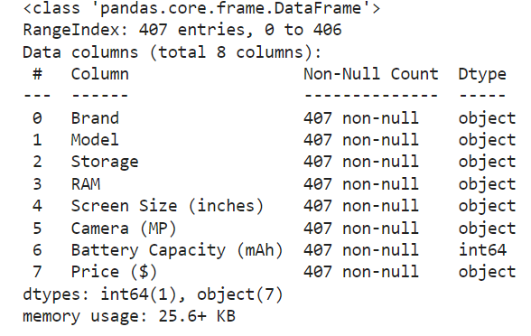
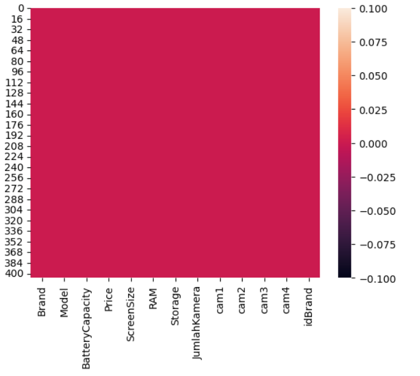

# Laporan Proyek Machine Learning

### Nama : Rehan

### Nim :

### Kelas : Malam B

## Domain Proyek

Zaman sekarang dimana teknologi dan informasi sudah berkembang, kebutuhan akan gadget pintar sangat meningkat pesat sehingga banyak produsen gadget
yang membuat berbagai macam gadget pintar. Dengan banyaknya varian dan jenis-jenis gadget pintar juga dengan harga yang sangat bervariasi, maka konsumen
perlu lebih selektif dalam memilih gadget pintar yang akan dibelinya, khususnya dibagian harga. Apakah dengan harga yang telah dipatok sudah sesuai dengan kebutuhan
yang diperlukan atau tidak.

## Business Understanding

Pada bagian ini, kamu perlu menjelaskan proses klarifikasi masalah.

Bagian laporan ini mencakup:

### Problem Statements

- Banyaknya varian gadget pintar sehingga membuat konsumen kebingungan untuk memilih.
- Konsumen kerap membeli gadget pintar yang terlalu mahal dan tidak sesuai kebutuhannya.

### Goals

- Solusi untuk konsumen agar ketika ingin membeli gadget pintar, dapat memperkirakan harganya terlebih dahulu, sesuai dengan kebutuhan yang ingin dipenuhi.

Semua poin di atas harus diuraikan dengan jelas. Anda bebas menuliskan berapa pernyataan masalah dan juga goals yang diinginkan.

### Solution statements

- Membangun suatu sistem yang dapat mempelajari suatu data (Machine Learning) terkait jenis dan harga untuk melakukan estimasi harga gadget pintar
- Sistem berjalan dengan menggunakan metode Regresi Linear yang dinilai cocok untuk melakukan estimasi.

## Data Understanding

Dataset yang digunakan berasal dari situs Kaggle yang berisi data harga dan spesifikasi gadget pintar. Dataset ini mengandung 407 entries dan 8 columns<br>

Contoh: [Mobile Phone Price](https://www.kaggle.com/datasets/rkiattisak/mobile-phone-price).

### Variabel-variabel yang terdapat pada Dataset adalah sebagai berikut:

- Brand = Adalah perusahaan yang mem-produksi handphone tersebut
- Model = Nama unik dari suatu seri produksi handphone
- Storage = Ukuran penyimpanan/memory internal dari handphone tersebut
- RAM = Berfungsi sebagai tempat penyimpanan df sementara dan hanya bekerja saat perangkat tersebut hidup
- Screen Size = Ukuran layar dari handphone tersebut, dijelaskan dalam ukuran inches
- Camera = Resolusi dan jumlah kamera dari handphone tersebut, dijelaskan dalam ukuran MegaPixel
- Battery Capacity = Ukuran/kapasitas batterai dari handphone tersebut, dijelaskan dalam ukuran mAh
- Price = Harga dari perangkat handphone tersebut

## Data Preparation

Pertama-tama mari import semua library yang dibutuhkan,

```bash
import pandas as pd
import numpy as np
import matplotlib.pypot as plt
import seaborn as sns
```

Setelah itu kita akan men-definsikan dataset menggunakan fungsi pada library pandas

```bash
df = pd.read_csv('Mobile phone price.csv')
```

Lalu kita akan melihat informasi mengenai dataset dengan syntax seperti dibawah:

```bash
df.info()
```

Dengan hasil sebagai berikut:
 <br>

Selanjutnya memeriksa apakah ada data yang berisi nilai null pada dataset:

```bash
sns.heatmap(df.isnull())
```

Dengan hasil sebagai berikut:
 <br>

### Merubah data menjadi integer

Ketika akan melakukan proses perhitungan dengan metode regresi linear, maka seluruh value harus bertipe integer. Jika dilihat dari informasi dataset diatas
maka kita menemukan bahwa terdapat beberapa column/llabel yang bertipe data string. Sehingga kita harus merubahnya terlebih dahulu.

#### Price

Pada label ini bertipe data object. Mari periksa apa saja data yang terdapat pada label ini yang bukan bersifat numeric dengan syntax dibawah :

```bash
y = [x for x in df['Price ($)'] if x.isnumeric() == False]
print(y)
```

Kita akan mendapatkan hasil sebagai berikut :

> ['$799 ', '$799 ', '$399 ', '$699 ', '$329 ', '$399 ', '$999 ', '$699 ', '$699 ', '$549 ', '$1,299 ', '$999 ', '$899 ', '$399 ', '$449 ', '$319 ', '$269 ', '$349 ', '$269 ', '$279 ', '$249 ', '$349 ', '$699 ', '$699 ', '$299 ', '$999 ', '$969 ', '$1,199 ', '$149 ', '$139 ', '$99 ', '$699 ', '$99 ', '$199 ', '$169 ', '$999 ', '$499 ', '$399 ', '$799 ', '$179 ', '$219 ', '$249 ', '$149 ', '$199 ', '$279 ', '$179 ', '$899 ', '$269 ', '$229 ', '$399 ', '$239 ', '$149 ', '$279 ', '$329 ', '$149 ', '$549 ', '$449 ', '$279 ', '$199 ', '$399 ', '$179 ', '$399 ', '$109 ', '$219 ', '$149 ', '$299 ', '$279 ', '$149 ', '$189 ', '$169 ', '$389 ', '$1,199 ', '$299 ', '$219 ', '$299 ', '$149 ', '$249 ', '$219 ', '$249 ', '$179 ', '$299 ', '$309 ', '$179 ', '$369 ', '$349 ', '$499 ', '$199 ', '$229 ', '$299 ', '$129 ', '$449 ', '$499 ', '$279 ', '$399 ', '$849 ', '$279 ', '$299 ', '$249 ', '$149 ', '$199 ', '$469 ', '$329 ', '$279 ', '$369 ', '$269 ', '$329 ', '$299 ', '$299 ', '$239 ', '$329 ', '$149 ', '$189 ', '$449 ', '$399 ', '$249 ', '$189 ', '$209 ', '$199 ', '$299 ', '$329 ', '$249 ', '$149 ', '$119 ', '$219 ', '$279 ', '$299 ', '$269 ', '$339 ', '$299 ', '$319 ', '$279 ', '$429 ', '$269 ', '$199 ', '$159 ', '$179 ', '$299 ', '$149 ', '$169 ', '$99 ', '$149 ', '$139 ', '$279 ', '$219 ', '$149 ', '$429 ', '$279 ', '$379 ', '$149 ', '$169 ', '$329 ', '$179 ', '$329 ', '$449 ', '$399 ', '$289 ', '$149 ', '$449 ', '$199 ', '$179 ', '$229 ', '$209 ', '$139 ', '$99 ', '$199 ', '$549 ', '$239 ', '$299 ', '$199 ', '$249 ', '$279 ', '$149 ', '$469 ', '$99 ', '$249 ', '$199 ', '$249 ', '$249 ', '$319 ', '$179 ', '$279 ', '$349 ', '$219 ', '$149 ', '$99 ', '$119 ', '$169 ', '$139 ', '$159 ', '$289 ', '$199 ', '$199 ', '$179 ', '$199 ', '$249 ', '$99 ', '$129 ', '$149 ', '$129 ', '$139 ', '$229 ', '$179 ', '$139 ', '$159 ', '$179 ', '$199 ', '$189 ', '$129 ', '$229 ', '$279 ']

Selanjutnya kita akan menghapus simbol 'dollar' agar data terbaca sebagai numeric menggunakan string punctuation dan looping untuk merubah simbol 'dollar'

```bash
import string
string.punctuation
```

```bash
ef removing_punctuation_df(df, column_name):
    """
    This function looks at a certain column. It then iterates through each row, first changing the object message
    into a string. Then it checks for any punctuations in the message and gets rid of them. Then we take the
    message and turn it into a integer and add it into a list.
    """
    removed_df = []
    for a in df[column_name]:
        message = str(a)
        punct_removed = [char for char in message if char not in string.punctuation]
        punct_removed = ''.join(punct_removed)
        punct_removed = int(punct_removed)
        removed_df.append(punct_removed)
    return removed_df
```

```bash
Price = removing_punctuation_df(df, 'Price ($)')
df['Price'] = Price
df = df.drop(['Price ($)'], axis=1)
```

#### RAM, Storage dan Screen Size

RAM, Storage dan Screen size masing-masing bertipe data object, Mari periksa apa saja data yang terdapat pada label ini yang bukan bersifat numeric dengan syntax dibawah :

```bash
y = [x for x in df['Screen Size (inches)'] if isfloat(x) == False]
print(y)
```

> ['6.8 + 3.9', '7.6 (unfolded)']

```bash
y = [x for x in df['Storage '] if x.isnumeric() == False]
print(y))
```

> ['128 GB', '256 GB', '128 GB', '128 GB', '128 GB', '128 GB', '256 GB', '128 GB', '128 GB', '256 GB', '128 GB', '128 GB', '128 GB', '64 GB', '256 GB', '128 GB', '128 GB', '128 GB', '128 GB', '128 GB', '128 GB', '128 GB', '128 GB', '128 GB', '128 GB', '64 GB', '32 GB', '128 GB', '32 GB', '128 GB', '128 GB', '128 GB', '64 GB', '128 GB', '128 GB', '128 GB', '128 GB', '128 GB', '64 GB', '64 GB', '64 GB', '64 GB', '64 GB', '128 GB', '128 GB', '64 GB', '128 GB', '128 GB', '64 GB', '64 GB', '128 GB', '256 GB', '64 GB', '32 GB', '128 GB', '128 GB', '128 GB', '256 GB', '128 GB', '128 GB', '128 GB', '64 GB', '64 GB', '128 GB', '128 GB', '128 GB', '128 GB', '128 GB', '64 GB', '128 GB', '128 GB', '128 GB', '128 GB', '128 GB', '128 GB', '256 GB', '64 GB', '128GB', '128GB', '128GB', '128GB', '128GB', '128GB', '256GB', '256GB', '256GB', '128GB', '128GB', '256GB', '256GB', '64GB', '128GB', '128GB', '128GB', '128GB', '128GB', '128GB', '64GB', '128GB', '128GB', '64GB', '32GB', '128GB', '256GB', '256GB', '32GB', '32GB', '32GB', '128GB', '32GB', '128GB', '64GB', '128GB', '128GB', '64GB', '256GB', '64GB', '128GB', '64GB', '64GB', '64GB', '128GB', '64GB', '128GB', '128GB', '128GB', '128GB', '128GB', '64GB', '128GB', '128GB', '64GB', '128GB', '128GB', '128GB', '64GB', '128GB', '64GB', '128GB', '32GB', '128GB', '32GB', '128GB', '128GB', '32GB', '128GB', '32GB', '128GB', '256GB', '128GB', '128GB', '64GB', '64GB', '128GB', '128GB', '128GB', '128GB', '128GB', '128GB', '128GB', '128GB', '128GB', '128GB', '64GB', '128GB', '128GB', '64GB', '128GB', '128GB', '128GB', '128GB', '256GB', '128GB', '128GB', '128GB', '128GB', '64GB', '128GB', '128GB', '128GB', '128GB', '128GB', '128GB', '128GB', '128GB', '128GB', '128GB', '128GB', '64GB', '128GB', '128GB', '128GB', '64GB', '128GB', '128GB', '128GB', '128GB', '128GB', '64GB', '64GB', '128GB', '128GB', '128GB', '128GB', '128GB', '128GB', '128GB', '128GB', '128GB', '128GB', '128GB', '128GB', '64GB', '128GB', '64GB', '64GB', '32GB', '32GB', '64GB', '128GB', '128GB', '32GB', '128GB', '128GB', '128GB', '32GB', '32GB', '128GB', '64GB', '128GB', '128GB', '128GB', '128GB', '64GB', '128GB', '128GB', '64GB', '128GB', '128GB', '64GB', '32GB', '128GB', '128GB', '128GB', '128GB', '64GB', '128GB', '128GB', '32GB', '128GB', '32GB', '128GB', '64GB', '64GB', '128GB', '128GB', '64GB', '64GB', '128GB', '128GB', '32GB', '32GB', '32GB', '64GB', '32GB', '64GB', '128GB', '64GB', '64GB', '64GB', '32GB', '64GB', '128GB', '32GB', '32GB', '64GB', '32GB', '64GB', '128GB', '64GB', '32GB', '64GB', '64GB', '128GB', '64GB', '32GB', '128GB', '64GB']

```bash
y = [x for x in df['RAM '] if x.isnumeric() == False]
print(y)
```

> ['6 GB', '12 GB', '8 GB', '6 GB', '8 GB', '4 GB', '8 GB', '6 GB', '8 GB', '12 GB', '6 GB', '6 GB', '8 GB', '4 GB', '12 GB', '6 GB', '8 GB', '6 GB', '6 GB', '8 GB', '6 GB', '4 GB', '6 GB', '8 GB', '6 GB', '4 GB', '3 GB', '6 GB', '3 GB', '4 GB', '6 GB', '4 GB', '3 GB', '6 GB', '8 GB', '4 GB', '6 GB', '8 GB', '4 GB', '3 GB', '3 GB', '4 GB', '4 GB', '8 GB', '8 GB', '4 GB', '8 GB', '4 GB', '4 GB', '4 GB', '4 GB', '4 GB', '4 GB', '2 GB', '6 GB', '4 GB', '4 GB', '6 GB', '8 GB', '8 GB', '12 GB', '4 GB', '3 GB', '8 GB', '8 GB', '6 GB', '8 GB', '6 GB', '3 GB', '4 GB', '4 GB', '4 GB', '8 GB', '6 GB', '4 GB', '12 GB', '4 GB', '4GB', '8GB', '8GB', '8GB', '6GB', '8GB', '12GB', '12GB', '12GB', '6GB', '8GB', '8GB', '8GB', '4GB', '6GB', '6GB', '8GB', '8GB', '8GB', '6GB', '4GB', '6GB', '6GB', '6GB', '3GB', '8GB', '12GB', '12GB', '3GB', '3GB', '3GB', '6GB', '2GB', '6GB', '4GB', '8GB', '6GB', '6GB', '12GB', '4GB', '6GB', '4GB', '4GB', '4GB', '6GB', '4GB', '8GB', '6GB', '6GB', '6GB', '4GB', '3GB', '6GB', '8GB', '4GB', '6GB', '6GB', '8GB', '4GB', '5GB', '4GB', '8GB', '3GB', '4GB', '3GB', '6GB', '8GB', '3GB', '4GB', '3GB', '8GB', '12GB', '8GB', '4GB', '4GB', '4GB', '6GB', '4GB', '4GB', '4GB', '8GB', '8GB', '4GB', '8GB', '6GB', '6GB', '4GB', '6GB', '6GB', '3GB', '6GB', '8GB', '6GB', '5GB', '12GB', '6GB', '4GB', '6GB', '4GB', '4GB', '6GB', '8GB', '6GB', '8GB', '4GB', '6GB', '4GB', '6GB', '6GB', '6GB', '4GB', '4GB', '6GB', '8GB', '4GB', '4GB', '6GB', '8GB', '6GB', '4GB', '8GB', '4GB', '4GB', '4GB', '6GB', '6GB', '4GB', '8GB', '6GB', '6GB', '8GB', '8GB', '6GB', '6GB', '4GB', '4GB', '6GB', '4GB', '4GB', '2GB', '2GB', '4GB', '4GB', '6GB', '3GB', '8GB', '6GB', '6GB', '3GB', '3GB', '8GB', '4GB', '8GB', '6GB', '8GB', '8GB', '4GB', '6GB', '4GB', '4GB', '6GB', '6GB', '4GB', '3GB', '4GB', '12GB', '6GB', '8GB', '4GB', '6GB', '4GB', '3GB', '8GB', '2GB', '4GB', '4GB', '6GB', '6GB', '8GB', '3GB', '6GB', '8GB', '4GB', '3GB', '2GB', '2GB', '4GB', '3GB', '4GB', '8GB', '4GB', '3GB', '4GB', '3GB', '4GB', '8GB', '2GB', '2GB', '4GB', '2GB', '4GB', '6GB', '4GB', '3GB', '4GB', '4GB', '4GB', '4GB', '3GB', '4GB', '4GB']

Setelah berhasil mendapatkan nilai yang bukan numeric, maka selanjutnya kita ubah data tersebut menjadi integer vlaue atau float value dengan syntax dibawah:
Dimulai dari label screensize, kita akan merubah data dengan fungsi df.iloc yang dapat mengakses langsung data sesuai lokasinya

```bash
df.iloc[88,4] = 6.8
df.iloc[373,4] = 7.8
```

Selanjutnya kita ubah label screen size menjadi float

```bash
df['Screen Size (in)'] = [float(size) for size in df['Screen Size (inches)']]
df = df.drop('Screen Size (inches)', axis=1)
```

kita membuat fungsi no_GBs untuk menghapus seluruh nilai GB dan merubahnya menjadi integer value

```bash
def no_GBs(df, column):
    y = []
    for x in df[column]:
        string = x.replace("GB", "")
        string = int(string)
        y.append(string)
    return y
```

Selanjutnya kita masukkan fungsi tersebut kedalam label RAM dan Storage

```bash
RAM = no_GBs(df, "RAM ")
df['RAM'] = RAM
df = df.drop('RAM ', axis=1)
```

```bash
Storage = no_GBs(df, 'Storage ')
df['Storage'] = Storage
df = df.drop('Storage ', axis=1)
```

#### Split label Kamera

Jika kita lihat di label/colum kamera, terdapat beberapa nilai sepert 12+12+3 yang mengindikasikan bahwa gadget tersebut memiliki beberapa kamera. Mari kita pisahkan
menjadi masing-masing label.
Menghitung Jumlah Kamera

```bash
df['JumlahKamera'] = df['Camera (MP)'].str.count('\\+') + 1
```

Memisahkan kamera

```bash
res1 = []
res2 = []
res3 = []
res4 = []
for x in df['Camera (MP)']:
    resolutions = x.split('+')
    tam = len(resolutions)

    if tam == 1:
        res1.append(resolutions[0])
        res2.append('0')
        res3.append('0')
        res4.append('0')

    if tam == 2:
        res1.append(resolutions[0])
        res2.append(resolutions[1])
        res3.append('0')
        res4.append('0')

    if tam == 3:
        res1.append(resolutions[0])
        res2.append(resolutions[1])
        res3.append(resolutions[2])
        res4.append('0')

    if tam == 4:
        res1.append(resolutions[0])
        res2.append(resolutions[1])
        res3.append(resolutions[2])
        res4.append(resolutions[3])

df['res1'] = res1
df['res2'] = res2
df['res3'] = res3
df['res4'] = res4

df = df.drop(columns='Camera (MP)')
```

Mengganti nama semula res menjadi cam

```bash
df.rename(columns = {"res1":"cam1","res2":"cam2","res3":"cam3","res4":"cam4"},inplace=True)
```

Merubah nilai yang bukan numeric (MP,3D,dll)

```bash
df['cam1'] = df['cam1'].str.replace('MP','')
df['cam2'] = df['cam2'].str.replace('MP','')
df['cam3'] = df['cam3'].str.replace('MP','')
df['cam4'] = df['cam4'].str.replace('MP','')
df['cam4'] = df['cam4'].str.replace('3D','0')
df['cam4'] = df['cam4'].str.replace('ToF','0')
```

Merubah tipe data menjadi float/int64

```bash

df['cam1'] = pd.to_numeric(df['cam1'])

df['cam2'] = pd.to_numeric(df['cam2'])

df['cam3'] = pd.to_numeric(df['cam3'])

df['cam4'] = pd.to_numeric(df['cam4'])
```

#### Memberikan Id Brand

Kita tahu bahwa setiap brand gadget memiliki valuenya masing-masing sehingga dapat memberika harga yang berbeda-beda sesuai value tersebut.
Maka kita akan memasukkan brand sebagai salah satu fitur, sbelumnya kita beri inisial pada setiap brand berdasarkan angka:

```bash
df['idBrand']=df['idBrand'].replace(['cat','sony','blackberry','lg','asus','google','huawei','oneplus','motorola','nokia','apple','vivo','realme','oppo','xiaomi','samsung'],['001','002','003','004','005','006','007','008','009','010','011','012','013','014','015','016'])
df[['idBrand']]=df[['idBrand']].apply(pd.to_numeric)
```

## Modeling

Tahapan ini membahas mengenai model machine learning yang digunakan untuk menyelesaikan permasalahan. Anda perlu menjelaskan tahapan dan parameter yang digunakan pada proses pemodelan.

**Rubrik/Kriteria Tambahan (Opsional)**:

- Menjelaskan kelebihan dan kekurangan dari setiap algoritma yang digunakan.
- Jika menggunakan satu algoritma pada solution statement, lakukan proses improvement terhadap model dengan hyperparameter tuning. **Jelaskan proses improvement yang dilakukan**.
- Jika menggunakan dua atau lebih algoritma pada solution statement, maka pilih model terbaik sebagai solusi. **Jelaskan mengapa memilih model tersebut sebagai model terbaik**.

## Evaluation

Pada bagian ini anda perlu menyebutkan metrik evaluasi yang digunakan. Lalu anda perlu menjelaskan hasil proyek berdasarkan metrik evaluasi yang digunakan.

Sebagai contoh, Anda memiih kasus klasifikasi dan menggunakan metrik **akurasi, precision, recall, dan F1 score**. Jelaskan mengenai beberapa hal berikut:

- Penjelasan mengenai metrik yang digunakan
- Menjelaskan hasil proyek berdasarkan metrik evaluasi

Ingatlah, metrik evaluasi yang digunakan harus sesuai dengan konteks data, problem statement, dan solusi yang diinginkan.

**Rubrik/Kriteria Tambahan (Opsional)**:

- Menjelaskan formula metrik dan bagaimana metrik tersebut bekerja.

## Deployment

pada bagian ini anda memberikan link project yang diupload melalui streamlit share. boleh ditambahkan screen shoot halaman webnya.

**---Ini adalah bagian akhir laporan---**

_Catatan:_

- _Anda dapat menambahkan gambar, kode, atau tabel ke dalam laporan jika diperlukan. Temukan caranya pada contoh dokumen markdown di situs editor [Dillinger](https://dillinger.io/), [Github Guides: Mastering markdown](https://guides.github.com/features/mastering-markdown/), atau sumber lain di internet. Semangat!_
- Jika terdapat penjelasan yang harus menyertakan code snippet, tuliskan dengan sewajarnya. Tidak perlu menuliskan keseluruhan kode project, cukup bagian yang ingin dijelaskan saja.
